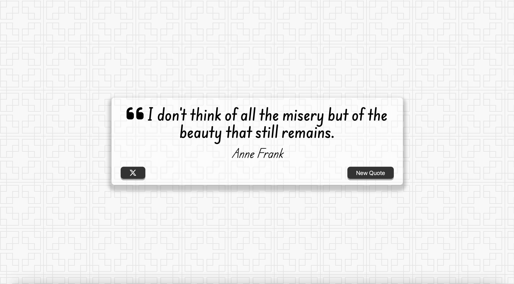

# Quote-Generator

A quote generator web app built with JavaScript that fetches random quotes from an API and displays them on the page.

## Preview

## Live Demo
- http://abdul-quote-generator-2025.s3-website.us-east-2.amazonaws.com

## 🚀 Features

- Fetches quotes from a public API
- Shows random quotes on click
- Responsive design
- Loading spinner while fetching
- Built with HTML, CSS, and Vanilla JavaScript
- Hosted on AWS S3 (static website hosting)

## 🛠️ Tech Stack

- HTML5 / CSS3
- JavaScript (Fetch API, DOM)
- Async/Await
- AWS S3 (static_hosting)

## 🧠 What I Learned

- Working with public APIs and async JavaScript
- DOM manipulation and UI feedback
- Hosting static websites on AWS S3
- Configuring S3 bucket permissions and policies
